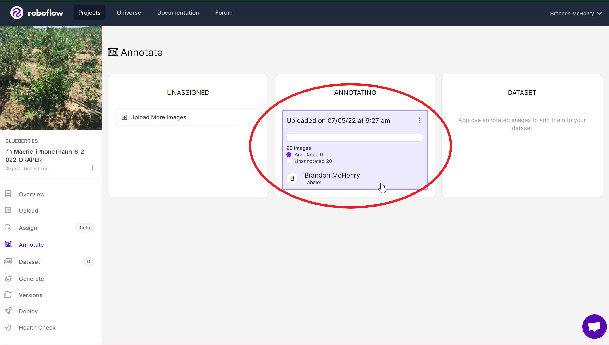
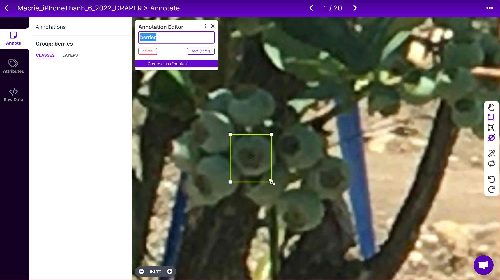

# Annotating

In this section, we will discuss not only how to annotate on Roboflow, but how WE (previous students) annotate our specific data.

## Getting Started - Annotating

Getting started annotating is a very straight-forward process. 

Click onto the job that has been assigned to you (or whomever).

Click onto any picture that has not been annotated yet.

Now you are greeted with your new home for the foreseeable future. The picture you chose sits in the background, while you are going to essentially draw annotation boxes around every* blueberry in the picture.

* Not necessarily every blueberry, we will get into that in just a moment.

To annotate your first blueberry, zoom into a spot and draw a box around it.

The idea is to get the entire blueberry (and not much else) in what is called the "bounding box". Different students vary in their following of the general rule of "Have the bounding box be snug around the berry". Personally, I do not view it as much of a problem if the box is a bit loose, but that is just my opinion. Later we will see some examples of annotations from different students, so that should give you a good idea of how it should be done.

In this example I did not quite fit the entire blueberry in, so it is important that you correct these mistakes as soon as they are made (by adjusting the box).

With the annotation finished, all we have to do is make sure it is in the right group. <b>This is very important, and any typo will be very difficult to reverse on a large scale (as Roboflow makes you fix annotations manually), so make sure you do this step accurately.</b>

We only have two groups, <b>green</b> and <b>blue</b>. (Depending on what stage the entire project is on, these groups may change with the goal of the datasets). Make sure that whatever you just labelled is in the correct group. 

<b>Tip 1:</b>
To make things easier, I recommend you do a lot of annotations in the same group, as the group type will be saved from the last annotation. Switching from blue to green to blue to green will just add to the time it takes to do these annotations (which is already a lengthy process). 

<b>Tip 2:</b>
There are a couple keyboard shortcuts worth knowing and using to make your workflow more efficient and make this process faster/easier. <b>D</b> on the keyboard will switch to the drag tool so you can move around the image faster. <b>B</b> on the keyboard will switch back to the bounding box tool. (Both of these are found on the right-hand side). However, <b>there is an even faster way</b>. By holding <b>Ctrl</b> on your keyboard, you temporarily switch into a dragging mode. Once you let go it automatically switches back to the bounding box tool. If you happen to make a box by mistake, just hit <b>Backspace</b> twice to remove it.

<b>General Advice</b>
Now, how you start annotating is entirely up to the user's discretion, but I (Brandon McHenry) personally like to start in the lower left corner and work my way all the way up. Once that whole column of blueberries is annotated, I slide over to the right and annotate that column from top to bottom. And then you slide over and repeat. (Note, this is just how I do it to ensure I do not miss any clusters of berries. Feel free to adjust this method however you want).

<b>Examples of Student Annotations</b>

