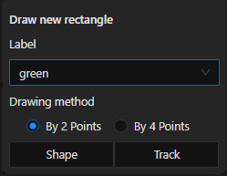
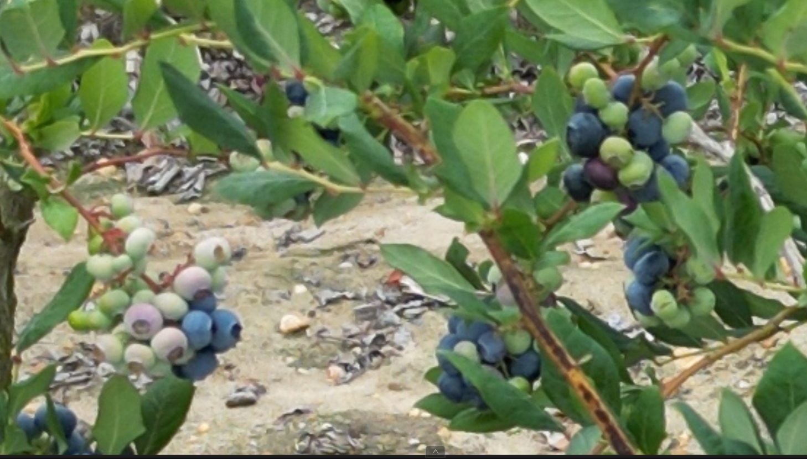
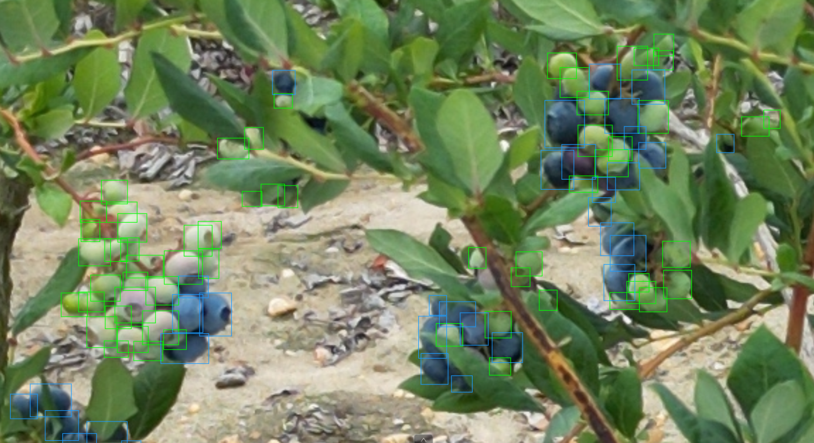
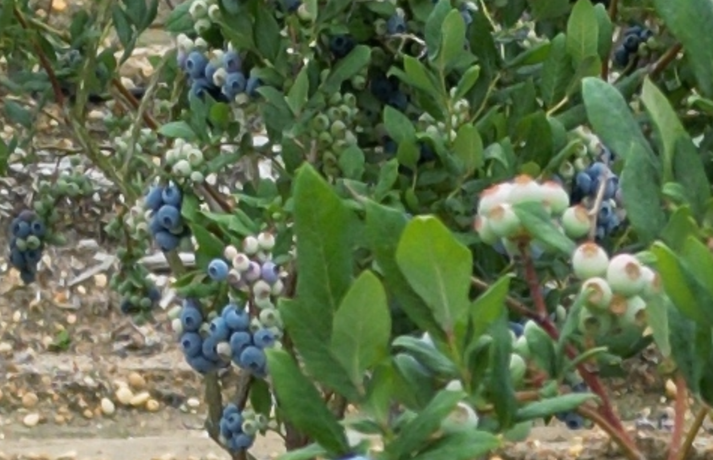
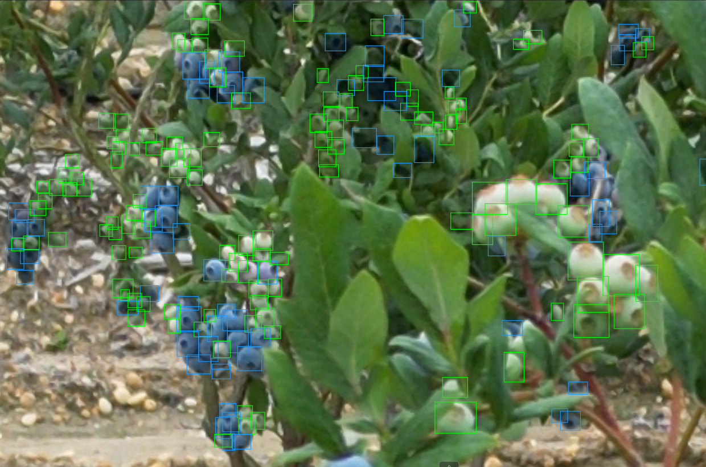

# Annotating

In this section, we will discuss not only how to annotate on CVAT, but how WE (previous students) annotate our datasets.

## Getting Started - Annotating on CVAT

This is what it looks like to open up a job.

This job already has some progress, so there are multiple objects already listed in the object list on the right side of the screen.

To begin annotating, we can click the “Draw new rectangle” tool, or press N for the shortcut key.

In the box that opens, we can choose the type of label we want to create (green/blue). Keep other settings the same.

## Annotating - Usual Case

As mentioned earlier, <b>N</b> is the annotating keyboard shortcut. I recommend that you dedicate your non-dominant hand to pressing <b>N</b> after each annotation.

So, Draw box, press <b>N</b>, draw box, press <b>N</b>, and so on..

In this example, I did the blue blueberries second, as CVAT auto selects the last label when annotating. <b>Doing all of one class at a time and then all of the other will save time.</b> You will feel this out over time.

<video width="" height="" 
       src="../../videos/Blue_Annotating.mp4"  
       controls>
</video>

After completing the annotations in your view, I highly recommend you slide up/down until you encounter additional berries.

<video width="" height="" 
       src="../../videos/Sliding_up.mp4"  
       controls>
</video>

I annotate in this snake-like pattern to ensure that I cover the entire image without missing any berries.

Be sure to fit the annotation bounding boxes as tightly as you can around the berry.

Over hundreds and thousands of berries, you may get sloppy, thankfully, we can adjust existing annotations.

<video width="" height="" 
       src="../../videos/Fixing_Annotations.mp4"  
       controls>
</video>

It’s important to be as accurate as we can, but I wouldn’t suggest hyper fixating on tiny fixes, only larger fixes.

## CVAT - Annotating - Medium Case

This example is more difficult due to occlusion, shadows, berries that look like leaves, etc.

Let’s see how this harder case example would be annotated…

This was a bit more challenging to annotate, especially when the bounding boxes begin to stack on top of each other, making it difficult to see where other berries in the cluster are.

<pre>
Tip: To hide/show the annotations, press T + H on the keyboard.
</pre>

## CVAT - Annotating - Hard Case

Often times there are bushes in the background that have visible berries. This can be difficult as some berries can be very visible, which makes it a lot more work to annotate. Or, the berries are hard to see fully, so there is some you can annotate and some you shouldn’t try to annotate.

Let’s see how the hard case would be annotated…

This was challenging to annotate, and likely is missing annotations. I tried my best, but there are many blurry green/blue blobs in the center of the image that make it hard to distinguish an individual berry.

<pre>
Tip: If you’re not sure if they are berries, alternate between zooming in & out (with your mouse wheel) to change your perspective.
</pre>

## Conclusion

You now know how to:
<ul>
<li>Annotate on CVAT
<li>Effectively annotate blueberries
</ul>

---

With this information, let's continue on to [Exporting Data on CVAT](../cvat/exporting.md).