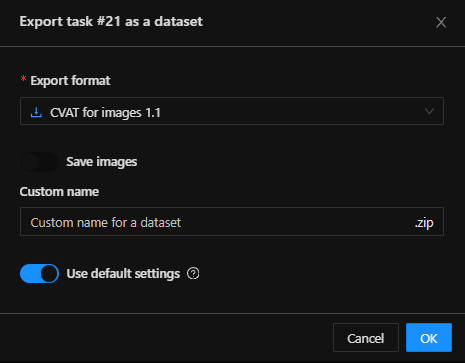
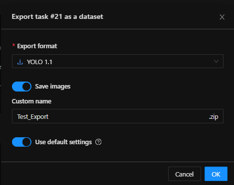
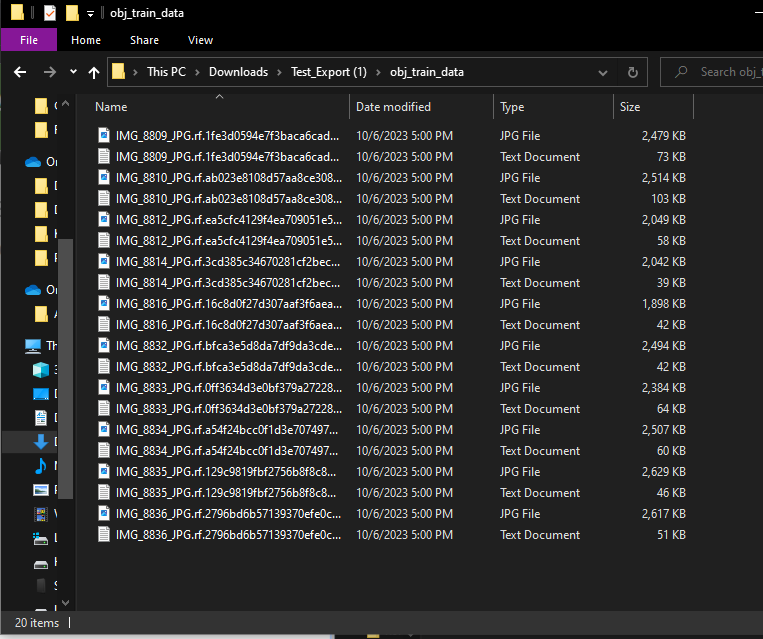
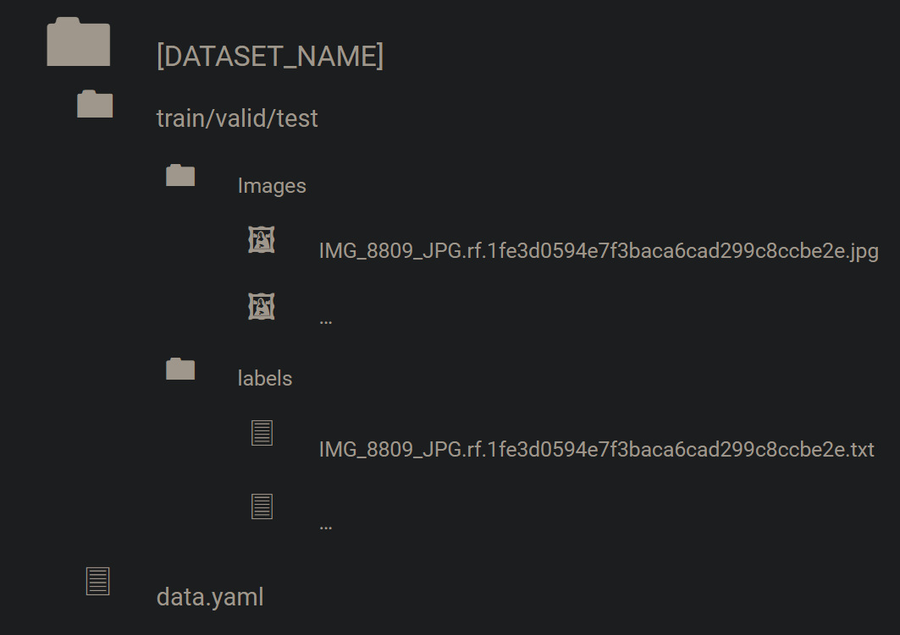
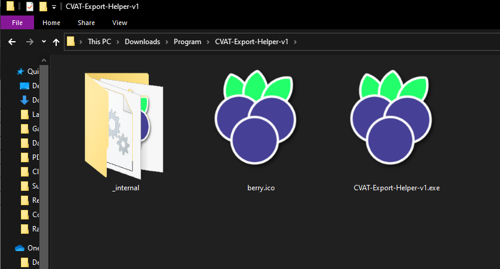
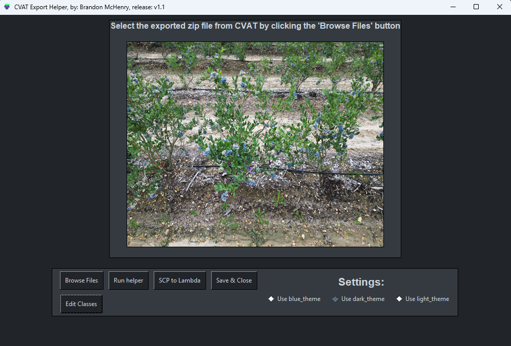

# Exporting an Annotated Dataset (to Lambda)


Training a model is very resource-intensive which requires us to utilize the power on the Lambda servers. In order to train a model, we will need to export our datasets to the Lambda servers. This process can be troublesome, so this documentation should make it easier.


## Exporting on CVAT


To export on CVAT, go to any task you wish to export and click the `Actions` button at the top right. Then click on `Export task dataset`.


This will open up a pop-up that looks like this:



On this pop-up, change the Export format to `YOLO 1.1` (located at the bottom of the drop-down menu), enable the `Save Images` toggle, and give the exported dataset a name following the naming conventions outlined here: <a href="https://docs.google.com/document/d/1oJtplLzHP9oU1HK5gBsq3X6EPYgcz3QsRaoJuoB4UE4/edit?usp=sharing">Naming Convention</a>



The dataset should then start downloading locally in a ZIP file like this one: 


If you extract the export from this ZIP file, our data looks like this.



This is actually a problem, because our data isn't following the file structure that we have traditionally used (not to mention the images and labels are not kept separate, which could be problematic, and there is no data.yaml file that YOLO needs for their scripts). To resolve this, let's look at what file structure DOES work (and that we use).


## Dataset File Structure (Modeled after Roboflow Export)


Students in this research project have traditionally used Roboflow as the platform to annotate and export data. As of Fall 2023, we have switched to using CVAT, which means our process of exporting has changed. To match the organization of our datasets with our older "Roboflow-exported" data, we have a series of steps to export data from CVAT.

But, before we blindly export our data following those steps, we must know what structure our files will follow. Here's what the file structure looks like:



The top-most directory is the name of the dataset that you are exporting. (See above for the naming convention outline).

Within this directory there are subdirectories for `/train/`, `/valid/`, and/or `/test/`. Whether or not these subdirectories exist depends on your use case for the data.

Within the `/train/`, `/valid/`, and/or `/test/` directories, there are two subdirectories, `/images/` and `/labels/`. As you can guess, the images for the dataset are in the `/images/` directory, and the annotations are found in a txt file (with the same name as the images) in the `/labels/` directory.

Then, finally, on the same level as the `/train/`, `/valid/`, and/or `/test/` directory(s), there is a data.yaml file (yaml is special file type, just think of it as another kind of txt file). This data.yaml file is used to store paths to our data when either training, validating, or testing a model.

The inside of a data.yaml file looks something like this (can be different depending on classes):

```
train: ./data/training_data/[DATASET_NAME]/train/images
val: ./data/training_data/[DATASET_NAME]/valid/images
test: ./data/training_data/[DATASET_NAME]/test/images

nc: 2
names: ['blue', 'green']
```

The values for train/val/test, are all relative paths from where the train.py, val.py, or detect.py scripts (default scripts in the YOLOv5 repository) are located. If these paths are incorrect, running any YOLOv5 scripts will produce errors relating to paths that don't exist, so it should be easy to tell if you have incorrect paths.

That example uses <b>relative paths</b>, but we're starting to use more <b>absolute paths</b> to avoid issues with relative path locations. So, a data.yaml can also look like this:

```
train: /mnt/data2/drone/[YOUR_NAME]/yolov5/data/training_data/[DATASET_NAME]/train/images
val: /mnt/data2/drone/[YOUR_NAME]/yolov5/data/training_data/[DATASET_NAME]/valid/images
test: /mnt/data2/drone/[YOUR_NAME]/yolov5/data/training_data/[DATASET_NAME]/test/images

nc: 2
names: ['blue', 'green']
```

In the data.yaml, there is also data relating to the number of classes (nc), and what the names of the classes are. This values will be different depending on the model you are training.


## Recreating this File Structure with CVAT


Because recreating that file structure can be tedious, we're going to use a custom-made application to expedite the process.


### The CVAT Export Helper

The program we're going to use is called "The CVAT Export Helper", and can be found on this documentation website on the [Software](/../scripts/software.md) page.


<pre>
Note: As of 1/18/24 the program does NOT work on Mac/Linux.
</pre>

After downloading and extracting the program from the zip file, you should see a folder that looks like this:



Opening the program with the executable file, you should see something like this:



Or perhaps something like this (an older version):


Depending on the release version, the buttons/settings may be a bit different, but at its core they should all be capable of helping the export process. 

#### Buttons

The `Browse Files` button will open the Windows File Explorer to allow you to select the ZIP file that exported from CVAT (see above for how to export from CVAT). The currently selected file's path will be displayed in the center of the application (see picture).

The `Run Helper` button will take the selected ZIP file and refactor its file structure to match the file structure as described above. This will also ZIP up the refactored folder, replacing the old ZIP file. In later versions of the application, this button will open a pop-up menu to configure the settings before running. These settings allow you to assign a certain percentage of the data to either train/valid/test folders. It is also possible to seed the random assignment of the images. And then lastly, depending on the kind of model you are training, you will want to select which class you are using (this is important for the data.yaml file). If a set of classes is not present on this screen, you must add them with the `Edit Classes` button (see below).


The `SCP to Lambda` button will take the selected ZIP file and SCP the file to Lambda. SCP is a way of transferring a file to/from a local and remote destination. It should also be noted, that in order to SCP any files onto Lambda, you must fill out the `Path on Lambda`, `Username on Lambda`, and `Password on Lambda` sections in the settings. Another thing to note is that part of the function of the `Run Helper` button, as previously mentioned, is to ZIP up the new folder with the correct format and replace the old ZIP file. This means that the path of the file you originally selected will still be correct, allowing you to SCP the file without having to re-select it.

The `Edit Classes` button will open a pop-up menu for the new class name e.g. (berry, bush, scorch, etc.) and class labels (blue,green). This will save to a JSON and will be loaded into the program on subsequent runs. There is also the option to remove an existing class in the JSON. Clicking on the `CLASS TO REMOVE` box opens up to a dropdown menu.


The `Save & Close` button will save the current settings (values are saved to a JSON file) for subsequent runs of the program and then close out of the application.

#### Settings

As mentioned previously, the settings may differ from version to version of this application.

In older versions of the application, the settings pane has various settings that are required to run the program correctly. These allow you to specify a type of folder (train/valid/test) to create to hold the data you're refactoring/exporting, select the type of class you are using, and specify the details for SCP-ing to Lambda. 

In newer versions of the application, the settings pane only has options to change the color scheme of the application.

## Conclusion

You now know how to:
<ul>
<li>Export a dataset from CVAT
<li>Best re-structure the format of our datasets
<li>Use the CEH to make exporting easier
</ul>

---

With this information, let's continue on to [Training](../yolo/training.md).