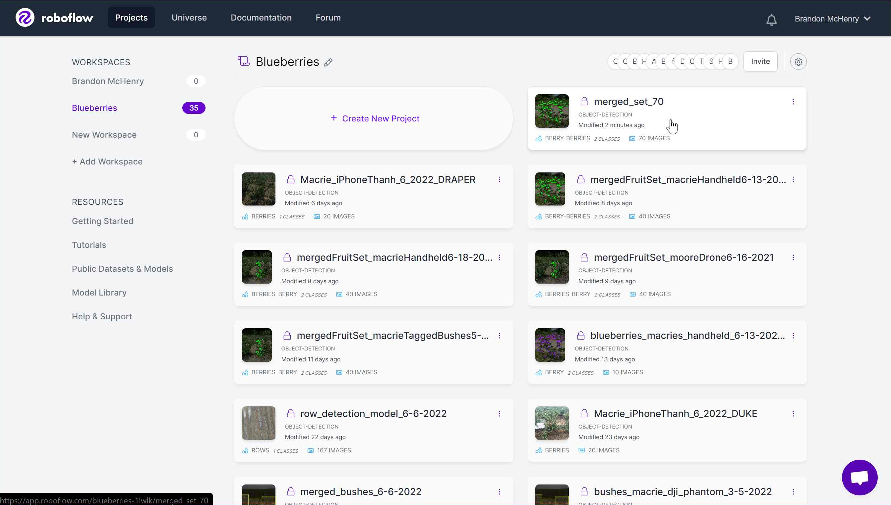
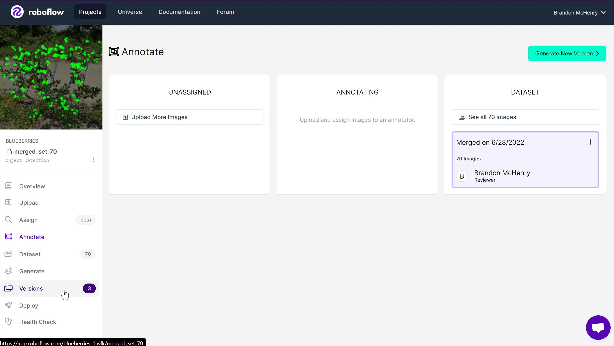
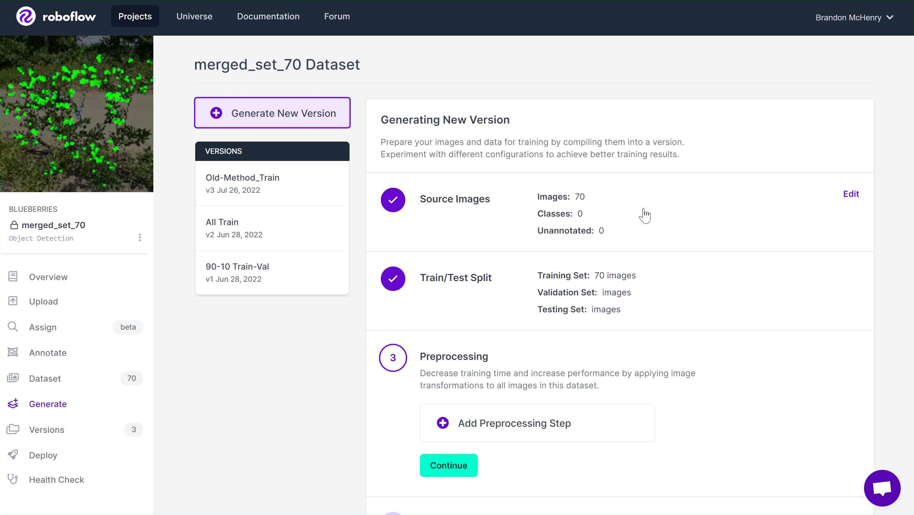
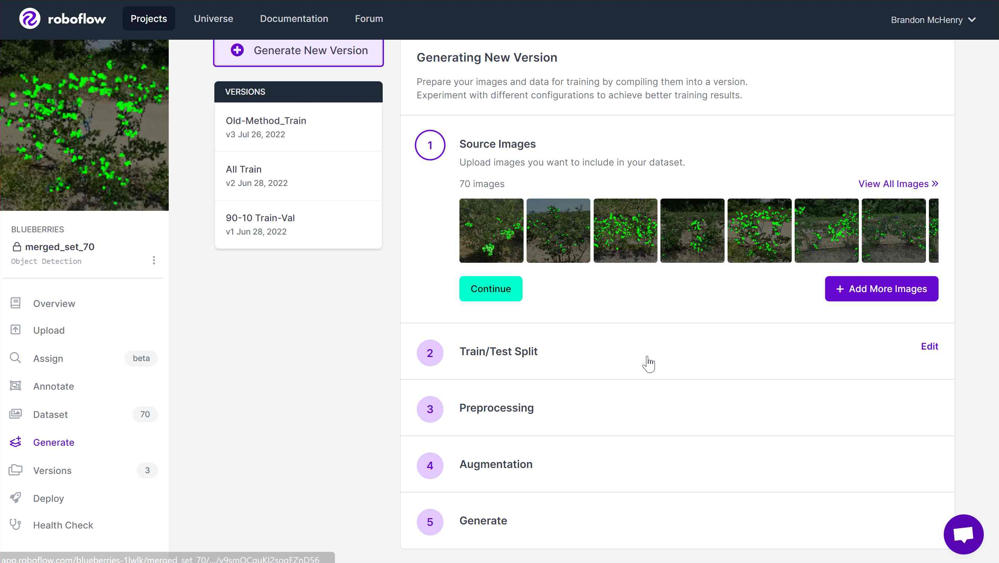
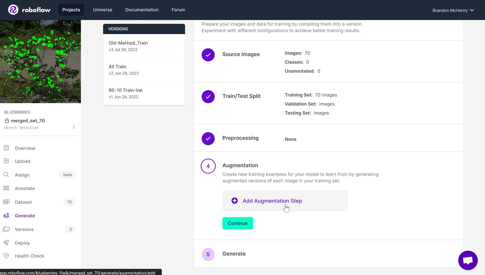
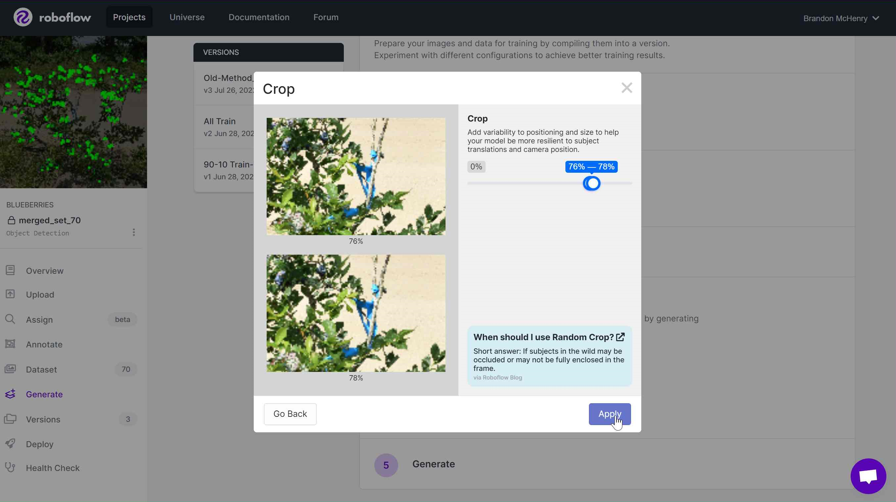
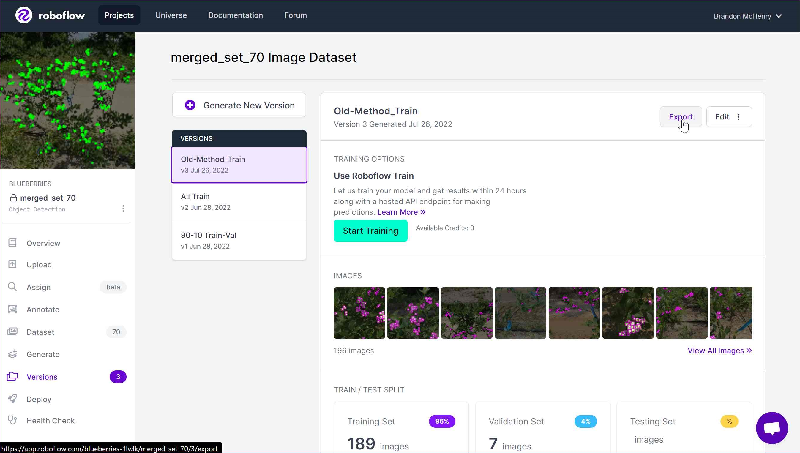
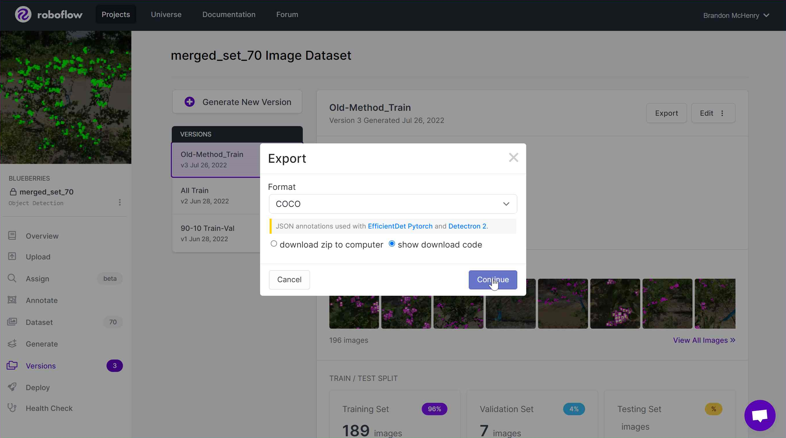
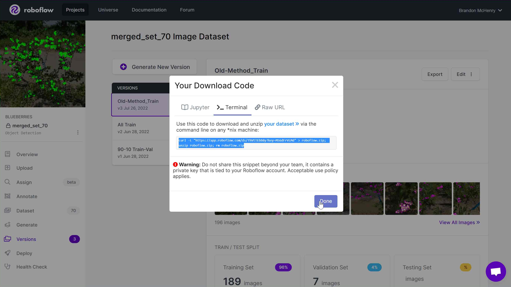

# Exporting an Annotated Dataset

This guide should help new prospective students export completed datasets that are going to be used for training the Yolo model.

## Generating a New Version of the Dataset

Well first things first, you have to choose which dataset you want to generate a new version for exporting.

Click the <b>Versions</b> tab in the left-hand toolbar.

Click <b>Generate New Version</b>.

If for some reason you need to, you can <b>add more source images</b> to the dataset in <u>step 1</u>.

<u>Step 2</u>, you can split the dataset into <b>training, validation, or testing</b>. 

###Manual Folding Datasets

So, in the past, we would <b>split the dataset into 90% training, 10% validation</b>. We would then just export that into <b>Yolov5</b> data and use it as is (after some augmentations, explained in just a moment).

###Automatic Folding Datasets

Now, because of cross-validation purposes, there are scripts to fold a dataset into N folds, which will separate sections of the data into the validation set for you. So if you plan/choose to use this method, then you want to <b>keep the dataset 100% training</b>.

We haven't really done any preprocessing options on Roboflow, so I won't cover <u>step 3</u>.

<u>Step 4</u>, augmentations. 

If you are using Cocosplit, you want to have <b>no augmentations</b>. 

If you are using "Robosplit" method, you want to have one augmentation. You want to <b>crop the photos, with a 76%-78% zoom</b>.

<u>Step 5</u>, generating the dataset. Here, if you chose to do "Robosplit", you want to make 3 images per augmentation.

## Exporting a Version

Once you have created a new version of the dataset, you want to click <b>export</b> to convert it into usable data.

If you are using the Cocosplit script, you will want to export it as <b>COCO</b> data.

If you are doing it the old-fashioned way with Robosplit or anything else, you will want to export it as <b>YOLO v5 Pytorch</b>.

Simply copy the code that is generated, and paste it into a linux terminal to copy over the exported data. The destination of where you want to copy the data over depends on if you are using Cocosplit or if you are using Robosplit.
