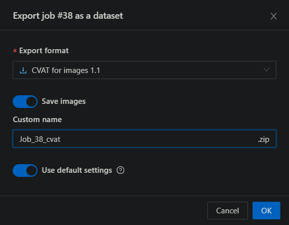
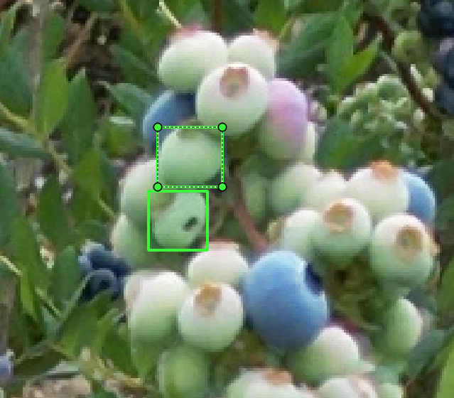
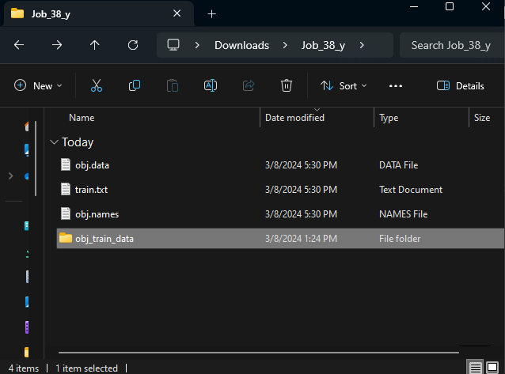

# Rowan Annotator

## Exporting Dataset from CVAT

Before we use the Rowan Annotator, you will need to export your data from CVAT in a specific way.

To load the annotation into the Rowan Annotator, you will need to export your data in the `CVAT` format.

Later, when we re-import our annotated data, we will need a YOLO formatted dataset as well.

<pre>
The program will unzip these files, you do NOT need to unzip it yourself.
</pre>

## Importing a Dataset

To import a dataset, click on the import button at the top-left.

This will open up your file explorer.

Navigate to where you exported your <b>CVAT formatted</b> dataset. And load the zip file.

This will then open up a pop-up to select a specific image (there could be more than one image loaded from the zip file).

Select whichever image you want, and hit confirm to open it.

## Annotating

Once your data is imported, it should display the image like this:

You will notice that there is an annotation count on the right-hand side. This will automatically update for each box you draw.

### Tools

On the left-hand side, there are an array of tools at your disposal. Let's go over them one at a time.

#### Cursor Tool

The cursor tool will allow you to `LEFT-CLICK` on individual annotations and move/adjust them. With only the cursor tool active, you cannot drag the image around or draw new boxes.

With a berry selected, you can also edit them with the `RIGHT-CLICK`. This will open a pop-up that lets you change the class, or delete the annotation.

#### Dragging Tool

The drag tool will allow you to `LEFT-CLICK` on the image to move around. With only the drag tool active, you cannot edit any berries or draw new bounding boxes.

#### Drawing Tool

The most important tool, the draw tool will allow you to create new annotations. The `LEFT-CLICK` functions as the dragging tool AND the cursor tool. Meanwhile, the `RIGHT-CLICK` functions as the drawing tool AND the cursor tool. This is done intentionally to make the annotation process more efficient.

When selecting the draw tool, a pop-up will appear to let you choose what kind of class you are drawing on the image. 

With this tool selected, you can create annotations by holding down `RIGHT-CLICK`. 

## Exporting

When you have finished your annotation, or if you just want to save your progress between sessions, you will need to export your annotations.

At the top-left, there is a button for exporting. Clicking this will open to your file explorer to save your annotations to a txt file in YOLO format.

## Re-Importing onto CVAT

If you remember when we exported from CVAT, we exported a YOLO formatted version of the dataset in addition to the CVAT formatted version.

Navigate to wherever you saved this version and unzip it.

Open the folder to see the contents of a YOLO formatted dataset.

Do not change any of the files at this level.

Open the `obj_train_data` folder to see our dataset's files.

Replace the txt file for the image you annotated with the txt file you exported from the Rowan Annotator.

Zip the entire folder back up "Job_38_y.zip". (This should replace the zip you previously had).

Go to CVAT, and import the new annotations for the job/task you are working on.

Select the annotation format as `YOLO 1.1`, and upload your new zip file.

<pre>
Note: There may be errors that pop-up when uploading the file. Sometimes it shows an error while still successfully importing the data. To confirm if you imported your data, open your job in CVAT and confirm it manually.
</pre>

---
Created by Luke Tonon
Written by Brandon McHenry, 3/8/24