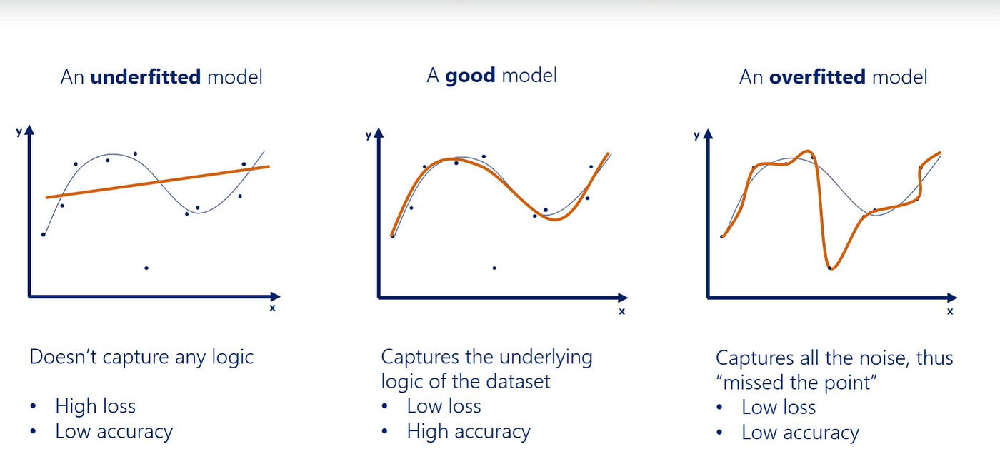
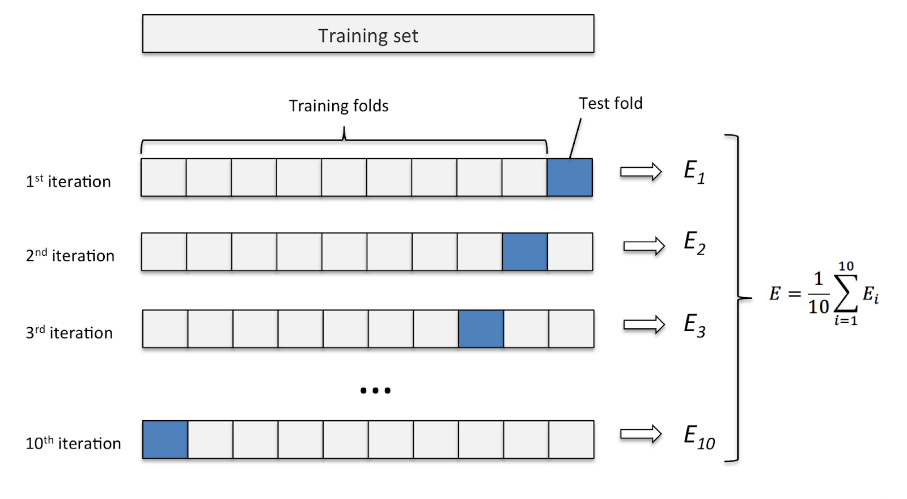
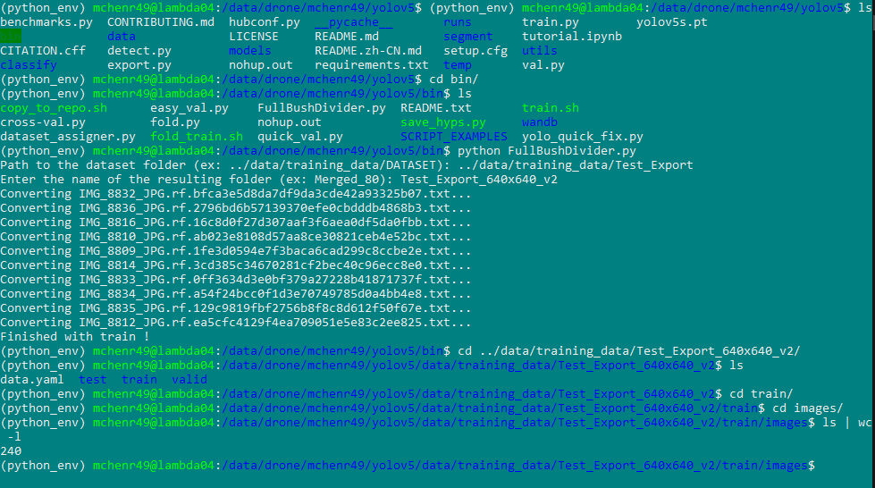
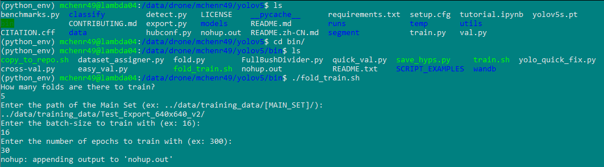
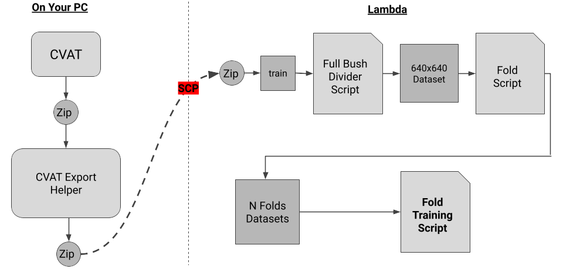

# How to Perform K-Fold Cross-Validation with YOLOv5

## Background

When we train our models, there is a possibility that we will underfit or overfit depending on the quality of our data and how we are training. It's possible that these issues will happen depending on what we're using in our training dataset and validation dataset. 

To tackle this problem, we can perform a special kind of training, <b>K-Fold Cross-Validation</b>. This will allow us to better assess the performance of our model.

## What is Cross-Validation?

The idea with <b>Cross-Validation</b>, is to take a dataset of 100% training data and split it into <b>N folds</b>. Each fold is then considered its own dataset and can be trained. 

The number of folds you use indicate how much of the data will go into training and how much will go into validation.

<pre>
<b>Example:</b> 

5 folds = The dataset is broken up into 5 equal parts (20% each fold)
10 folds = The dataset is broken up into 10 equal parts (10% each fold)
</pre>

## Cross-Validation with YOLOv5

To conduct cross-validation with YOLOv5 on Lambda, you will first need a dataset to work with. 

For steps on how to export data from CVAT to Lambda see [Exporting](../cvat/exporting.md).

### 0. Augmenting the Dataset

The dataset you want to use will need to be augmented on BEFORE continuing with any other step.

The screenshot below depicts augmenting the dataset to be in tiles rather than full-sized images (likely the augmentation you will want to perform).

<pre>
It's important to note that you should NOT assign any part of the dataset to valid (or test), as the folding will be handling this step.
</pre>

### 1. Folding

To fold a dataset of 100% training data, you can use the `fold.py` script in the `Yolov5_Scripts` repository.

This will ask you for the location of the dataset you want to use, and how many folds to split the dataset up into. This number is almost always going to be 5, but it is possible you want to use something else. 

This script will effectively copy the dataset into 5 variations of the dataset, all of which are trainable. 

To see more details on this script see [fold.py](../scripts/scripts.md#foldpy).

### 2. Train the Folds

With N folds of the dataset now created, we can then train each fold. If you read [Training a YOLOv5 Model](../yolo/training.md), then you should know the process of running a 1 training job at a time. In this case, we will perform multiple jobs at once!

To train multiple folds, you can use the `fold_train.py` script in the `Yolov5_Scripts` repository.

This will ask you for how many folds there are to train, as well as the path of the dataset that the folds were created from. And then, as with any other training jobs, we will also set a batch-size and number of epochs. 

<pre>
It is very likely that your ability to run multiple training jobs will be impacted by other students using the GPUs! Be sure to use the command `nvidia-smi` to see the status of GPUs.

You may be able to mitigate this by doing a smaller batch-size!
</pre>

More information about this can be found here: [CUDA Memory](../yolo/training.md#something-about-cuda-memory)

To see more details on this script see [fold_train.py](../scripts/scripts.md#fold_trainpy).

### 3. Assess Each Fold Training

Each finished training run will have results saved to `/yolov5/runs/train/DATASET/Fold#/`. Among many files, there will be a results.csv that contains metrics at every epoch of training. You can use this file to assess the performance of the training on that specific fold.

Over the lifetime of this project, we have used multiple methods of visualizing these results. Unfortunately, with the older forked repo we use, our previous methods of visualizing/analyzing these results are not compatible anymore. So, we have our own way of looking at the results and plotting the metrics.

See [Visualizing Results](../yolo/results.md) for more information on how to visualize your results from fold training.

<u>The most important aspect of cross-validation is this step.</u> You can compare the metrics between each fold and come to a conclusion about the model's average performance. 

If any fold performs PARTICULARLY poorly compared to the rest, then you can conclude that there is something wrong with the data being used in the validation set.

## Conclusion

The pipeline/workflow for cross-validation can be represented like so:

---

You now know how to:
<ul>
<li>Fold a dataset for cross-validation
<li>Train multiple datasets at one time
</ul>

---

With this information, you can either continue on to [Making Predictions with YOLOv5](../yolo/predicting.md) or [Validating a YOLOv5 Model](../yolo/validating.md) (depending on what you're doing).