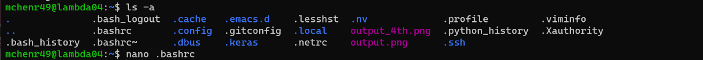
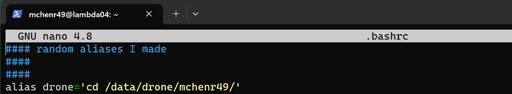

# Preparing Lambda & Familiarizing with Linux

## 1. Editing .bashrc File to Add Alias(es)

Once on Lambda, I recommend doing the following to slightly increase productivity.

You can create custom commands using “aliases” in Linux. For productivity, we’ll add a new alias to speed up going to the directory for this project.

<ol>
<li>Open a text editor to edit .bashrc file with nano .bashrc

<li>Add “alias drone='cd /mnt/data2/drone/[YOUR FOLDER]/'

<li>Save with `CTRL+O`, then press `ENTER`
<li>Close editor with `CTRL+X`
<li>Any changes to a .bashrc file must then be sourced. So run: source .bashrc
</ol>

## 2. Cloning the Yolov5 Repository & Setup

In `/mnt/data2/drone/[YOUR NAME]/` use the following command to clone the YOLOv5 repo:

`git clone https://github.com/Razzberry7/yolov5.git` (a forked repo of the YOLOv5 repository)

<i>If you need to push changes to the repository for any foreseeable reason, you should clone the repository with SSH rather than HTTPS. (Requires being added as a contributor!)</i>

## 3. Environment Setup

<pre>
<b>Note:</b> The yolov5 repo contains a yolov5_requirements.txt. Use this file for the virtual environment in the following instructions.
</pre>

To set up a virtual environment for this project, follow the instructions here: [Virtual Environment Setup](/../yolo/venv.md).

## 4. Cloning Repository for Custom Scripts

Lastly, we are going to clone a repository of custom scripts I have made that will come in handy.

My repository is located here: https://github.com/Razzberry7/Yolov5_Scripts

Command: `git clone https://github.com/Razzberry7/Yolov5_Scripts.git`

<i>If you need to push changes to the repository for any foreseeable reason, you should clone the repository with SSH rather than HTTPS. (Requires being added as a contributor!)</i>

## 5. Change the Config.ini Values

Before using any scripts, please make sure to edit the config.ini file in the `/Yolov5_Scripts/util/` directory! 

You'll need to replace my name "mchenr49" with yours. You may also need to edit certain paths if they are different from where you put certain directories.

---

For more information on what the scripts do and how to use them, please read the README.txt in the repository, or read the documentation at [Custom Scripts](/../scripts/scripts.md).
