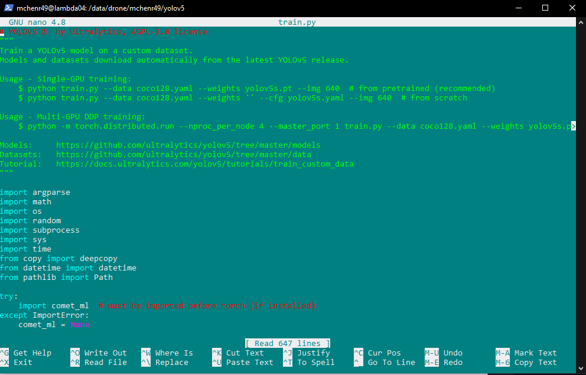

# Training a YOLOv5 Model

## Understanding the train.py script
The Yolov5 repo comes equipped with scripts that we can use to train, validate, or test our models.

For now, we’ll focus on train.py.

I recommend opening up the scripts (and that goes for scripts made by the team as well) and seeing how to use it, and what the code is doing.

To get an idea of how to use train.py, let’s see what can figure out by opening it in nano: `nano train.py`

At the top we should see some examples of how we can use this script. (It's good practice to include these at the top of your scripts as well.)

### Usage
According to their Usage comment, the following command would train on a single GPU: `python train.py --data --coco128.yaml --weights yolov5s.pt --img 640`

This example seems pretty simple, but only if you use a couple of parameters, there are many settings/parameters that we can pass in, so let's get an idea of what those look like. 

Scrolling down in this script, we can find a parse_opt function and get an idea of all the different parameters we can use (and their defaults).

### Notable parameters:
<ul>
<li>weights - The size of model you want to create.
<li>data - The path to the data.yaml of the dataset you are using.
<li>hyp - The hyperparameter file you want to use.
<li>epochs - The number of epochs for training.
<li>batch-size - The batch size for the GPU (higher number quickens training time at the cost of the GPU working harder)
<li>imgsz - The dimension of the images in training (assumes it is square).
<li>device - The GPU to assign this training job to.
<li>name - The name of the training job.
</ul>

If you want to read more about the parameters, there's a bit more information here: https://github.com/ultralytics/yolov5/issues/6507

## Using train.py

IN PROGRESS