# Getting Started with CVAT

This guide should help new prospective students get started with CVAT and should transition into the next section, which details the annotation process.

The way we have CVAT set-up, we are hosting our shared project folders via Lambda, the server in Rowan’s math department.

CVAT runs locally but through Lambda, so we have to open a port from Lambda to our localhost.

Let’s quickly review how we log onto Lambda, and then explore how we can connect to CVAT through our Lambda connection.

## Logging onto Lambda

Normally, to log onto Lambda, we use our Cisco VPN, and use some kind of terminal to SSH onto the server.

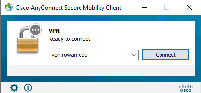

You can use PuTTy, MobaXterm, Git Bash, Powershell, etc. to SSH onto the server using this command: 

<b>ssh mchenr49@lambda04.rowan.edu</b>

My school name is “mchenr49”, so you’ll have to replace this with your own.

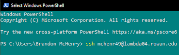

## Connecting to CVAT via Lambda

To open CVAT via Lambda, we use the SSH command again with additional parts to open port 8080 for CVAT on our localhost.

<b>ssh mchenr49@lambda04.rowan.edu -L 8080:localhost:8080</b>

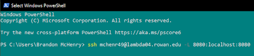

## Opening CVAT

Now that we’ve opened port 8080 for CVAT, we can open up a browser and type “http://localhost:8080/” into our browser’s address bar.

<pre>
Email Professor Hieu Nguyen (nguyen@rowan.edu) for login information if you do not already have it.
</pre>

Logging in with the accounts created by Professor H, you’ll be greeted with this page.

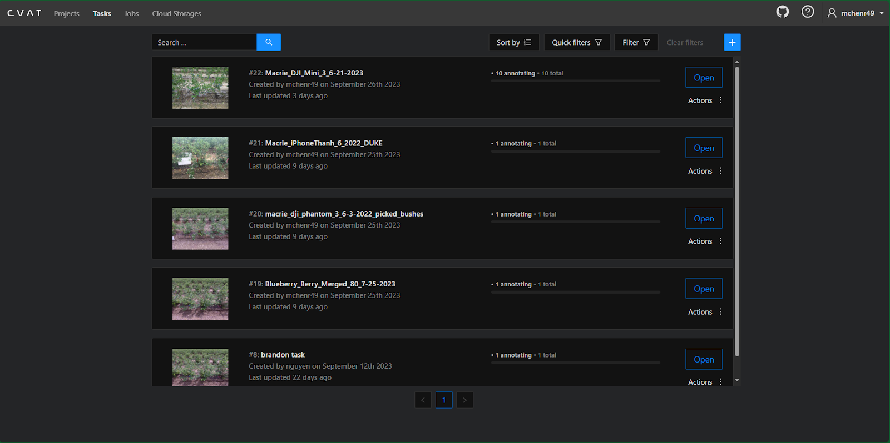

## CVAT - Tabs

On CVAT, whole datasets are organized in <b>projects > tasks > jobs</b>.

A <b>project</b> is for a specific model, e.g., a berry count model, a bush model, etc.

A <b>task</b> is for a dataset, e.g., 10 drone photos.

A <b>job</b> is small batches of work from a task to assign to people.

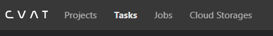

## CVAT - Making a Project (New Model)

If you need to create a brand new model (very unlikely), then you will need to create a new project.

<ol>
<li>Clicking the <b>blue (+)</b> lets you create a new project.

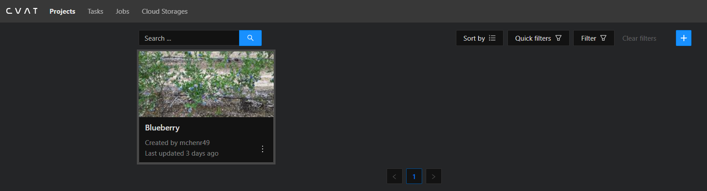

<li>On this page, you add a project name and the relevant labels (and their bounding box colors if you wish to change them).

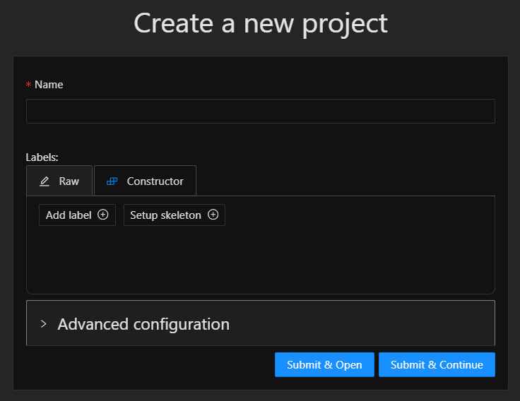

<li>Submit & Open to finish and open that project up. Or, Submit & Continue to finish creating the project without opening it.
</ol>

## CVAT - Making a Task/Jobs (New/Additional Datasets)

Far more likely you will need to create tasks and subsequently jobs.

Essentially the same process as before but with more options.

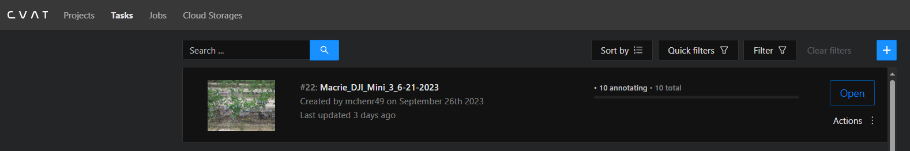

<ol>
<li>We will choose to inherit our defined labels from the project.

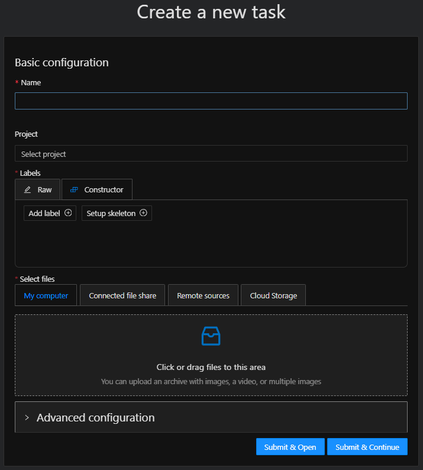

<li>Submit & Open to finish and open that project up. Or, Submit & Continue to finish creating the project without opening it.
<li>Upload pictures obtained via our shared drive.
<li>Open the “Advanced configuration” dropdown, and change image quality to 100.

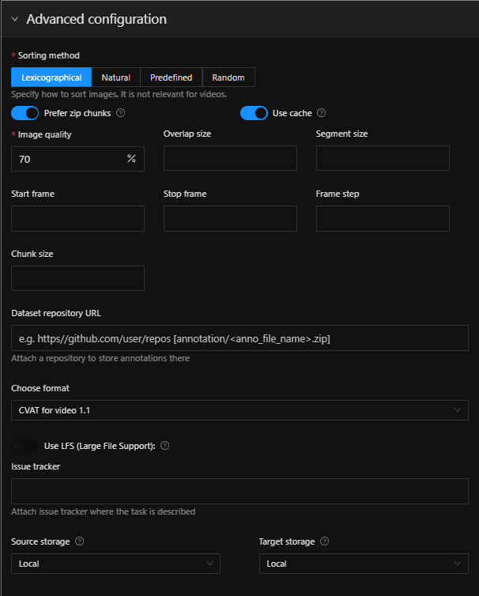

<li>In this dropdown, you can set the job size in “segment size”. E.g., a task of 10 photos with a segment size of 2 will create 5 jobs of 2 photos each. 
<ul><li>Uneven segments will produce as many jobs at that segment size as possible, e.g., (3/3/3/1).</ul>
<li>Submit & Open to finish and open that task up. Or, Submit & Continue to finish creating the task without opening it.
</ol>

## CVAT - What a Task Looks Like

This is what it looks like to open up a newly created task. 

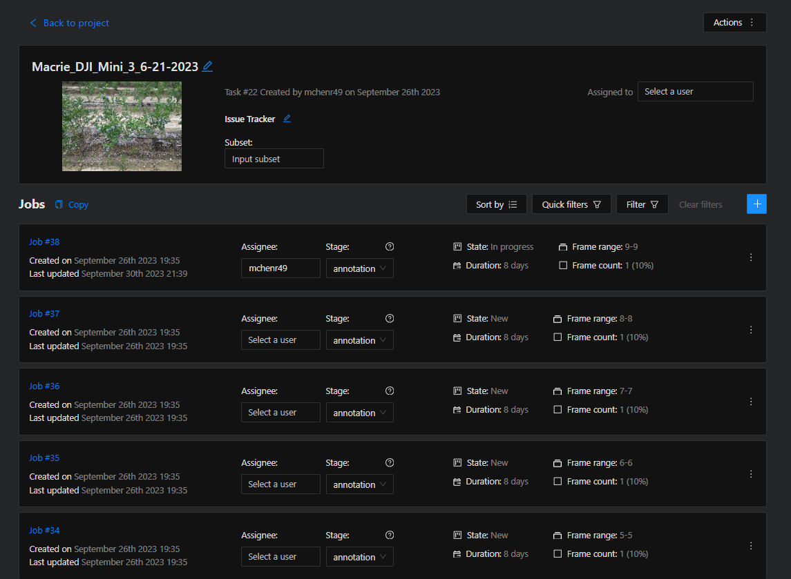

This example has 10 photos and a segment size of 1, meaning there are 10 unique jobs to assign to people.

Because CVAT can also be used for videos, pictures are referred to as frames across the tool.

Clicking on a <b>Job #</b> will open that job for annotating.

## Conclusion

You now know how to:
<ul>
<li>Log into Lambda and open a port for CVAT
<li>Create projects in CVAT for new models
<li>Create tasks & jobs for new datasets
</ul>

---

With this information, let's continue on to [Annotating on CVAT](/../cvat/annotating.md).