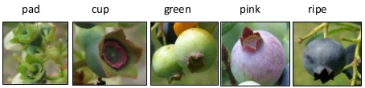

# What Blueberries Look Like

Before we get started annotating blueberries, it’s helpful to know what berries look like and how that differs over their growth cycle.

The most obvious characteristic of a blueberry is its round shape. But, their “<b>crowns</b>” are arguably more obvious when you begin annotating harder to see berries.

We do not annotate the <b>pad</b> stage, and in most cases we do not annotate the very small cups in the cup stage.

The green berries are annotated as “green”, and the ripe berries are annotated as "blue".

But, the pink stage is variable. At times it is almost red, which are annotated as blue, but there are times where pink berries are more green, which should be annotated as green.
