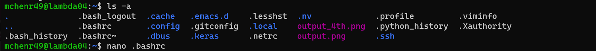
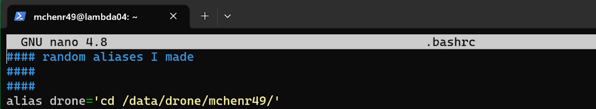

# Preparing Lambda & Familiarizing with Linux

## 1. Editing .bashrc File to Add Alias(es)

Once on Lambda, I recommend doing the following to slightly increase productivity.

You can create custom commands using “aliases” in Linux. For productivity, we’ll add a new alias to speed up going to the directory for this project.

<ol>
<li>Open a text editor to edit .bashrc file with nano .bashrc

<li>Add “alias drone='cd /data/drone/[YOUR FOLDER]/'

<li>Save with CTRL+O, then press ENTER
<li>Close editor with CTRL+X
<li>Any changes to a .bashrc file must then be sourced. So run: source .bashrc
</ol>

## 2. Cloning the Yolov5 Repository & Setup

In <b>/data/drone/[YOUR NAME]/</b> use the following command to clone the YOLOv5 repo:

git clone https://github.com/Razzberry7/yolov5.git (a forked repo of the YOLOv5 repository)

Then, <b>cd</b> into this directory (<b>/data/drone/[YOUR NAME]/yolov5/</b>)

For organizational purposes let’s make additional directories:

At <b>/data/drone/[YOUR NAME]/yolov5/</b>:

mkdir bin (to hold scripts we create)
     
At <b>/data/drone/[YOUR NAME]/yolov5/data/</b>:

mkdir training_data (to hold data designated for training)

mkdir validation_data (to hold data designated for validation)

mkdir predictions (to hold subdirectories)

mkdir predictions/datasets/ (to hold data designated for predictions)

mkdir predictions/results/ (to hold results for predictions)

## 3. Environment Setup

<pre>
Note: The yolov5 repo contains a requirements.txt by default. Use this file for the virtual environment in the following instructions.
</pre>

To set up a virtual environment for this project, follow the instructions here: [Virtual Environment Setup](/../yolo/venv.md).

## 4. Cloning Repository for Custom Scripts

Lastly, we are going to clone a repository of custom scripts I have made that will come in handy.

My repository is located here: https://github.com/Razzberry7/Yolov5_Scripts

Command: git clone https://github.com/Razzberry7/Yolov5_Scripts.git

You can clone this repo wherever you want, but typically it is in either the <b>`/data/drone/NAME/yolov5/`</b> directory, or right above it at <b>`/data/drone/NAME/`</b>.

### 5. Change the Config.ini Values

Before using any scripts, please make sure to edit the config.ini file in the /Yolov5_Scripts/util/ directory! 

You'll need to replace my name "mchenr49" with yours. You may also need to edit certain paths if they are different from where you put certain directories.

---

For more information on what the scripts do and how to use them, please read the README.txt in the repository, or read the documentation at [Custom Scripts](/../scripts/scripts.md).
