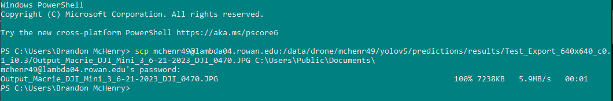

# Making Predictions with YOLOv5

## Prerequisites

### Weights from Training

To make predictions with YOLOv5 you will first need weights to apply to the model. You obtain these weights by training a model. See [Training a YOLOv5 Model](../yolo/training.md) if you haven't done this step.

### New Images

Unsurprisingly, we need new images to actually make predictions on. You <b>SHOULD NOT</b> make predictions on images used in the training dataset, as there is an obvious conflict of interest that will likely mean your resulting predictions aren't accurate.

## Using `YOLO_Predictor.py`

By applying these weights to the YOLOv5 model, we can feed in our new picture for the model to make predictions on. Fortunately, we have a script that can do all this for us.

The `YOLO_Predictor.py`, found in the `Yolov5_Scripts` repository will allow us to make predictions easily.

With your python environment active, you can run the script like so: `python YOLO_Predictor.py`.

It will prompt you to change the settings for predictions. If you don't, it will use defaults (See below). 

If you choose to change the settings, it will ask: 
<ul>
<li>what <b>confidence threshold</b> you want to set
<li>what <b>IOU threshold</b> you want to set
<li>if you want the model to be<b>agnostic</b>
<li>if you want the model to be <b>multi label</b>
<li>if you want to hide labels
<li>and if you want to hide confidence scores for each label
</ul>

It will then ask the path to the images you're making predictions on, where you'd like to send the results, the name to give this prediction, and the size of the tiles you're making predictions on.

(Behind the scenes, this predictor cuts the image into tiles, makes predictions on those tiles, and then stitches them back together into one whole image.)

## Seeing the Results

According to where you send the results to be saved, there will be an image with the predictions drawn on it. You will more than likely want to see this image, so let's take it off of Lambda.

### Exporting from Lambda

You can export a file from Lambda using the `scp` command. Alternatively, if you are using MobaXterm, you will likely be able to quickly copy it from your terminal file system.

#### SCP Command

Since I'm a masochist, I'll be using the `scp` command to copy the files to my local machine.

You will need a new terminal window (not logged into Lambda).

The `scp` command takes two parameters: the location of the file from one area, and the location to copy it to.

Since the file is on Lambda, you will need to add information about the server: `YOUR_NAME@lambda04.rowan.edu:/path/to/the/file.png`. 

It will ask for your login so that it can fetch the file from the server, and if your paths are all correct you will see the information on the right-hand side change as it copies the file over.

When you copy the file over, head to the destination you set, and open the image. It should look something like this:

## Conclusion

You now know how to:
<ul>
<li>Make predictions using a YOLOv5 model
<li>Use the SCP command to move files between a local machine and server
</ul>

