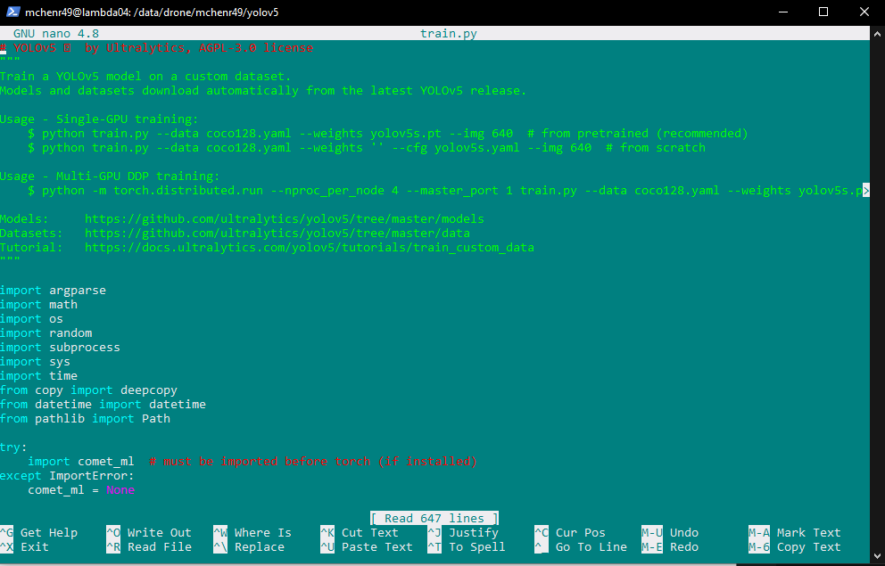
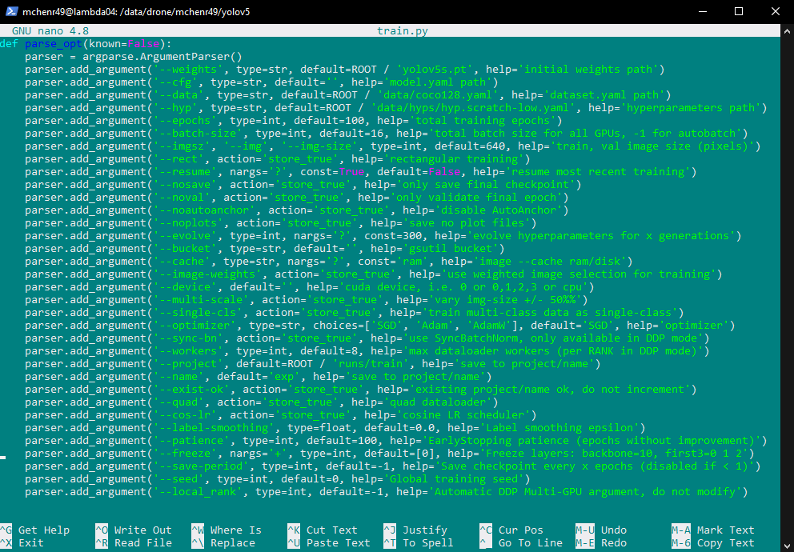
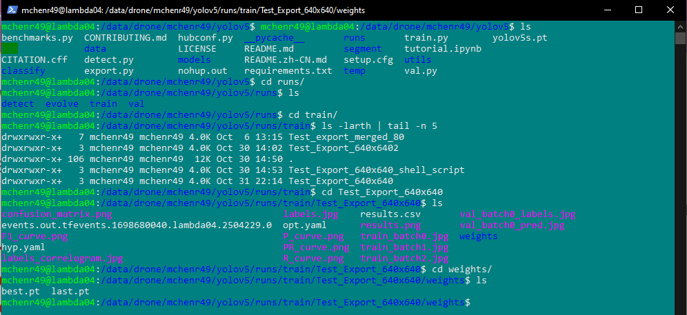
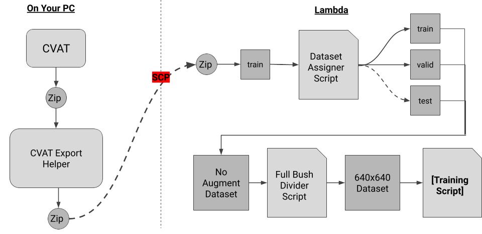

# Training a YOLOv5 Model

After you successfully export some dataset to Lambda (see [Exporting Data on CVAT](../cvat/exporting.md)), you will want to train with that dataset. In order to train, we will have to ensure our data is ready for training.

## Preparing Dataset

Every training session needs training data (obviously), but it also needs validation data to generate metrics during training. You <b>CANNOT</b> train without validation data. 

We will also want to make sure we perform any augmentations to our dataset before using it to train.

### Assigning Images to Validation Dataset

You may use a platform to export your data split up into train/valid/test folders. If you are using CVAT, you will have to do this yourself. Fortunately, we have a script for it. 

Using the `dataset_assigner.py` script, you can assign a certain percentage of your data in train/valid/test (for more details, see [dataset_assigner.py](../scripts/scripts.md#dataset_assignerpy))

<pre>
<b>NOTE:</b> 

If you intend to split this data into tiles, or any other kind of augmentation that will increase the number of images/labels in your dataset, you will want to perform this step <b>LAST</b>. 

<b>Imagine:</b> You have 10 full-sized images, assign 2 to valid, and then split all of the data into tiles, generating 25 tiles each image. Your dataset is much larger now, but the validation dataset is limited to data from those 2 photos you originally assigned, rather than assigning 50 tiles from a tiled dataset of 250 images.
</pre>

### Augmentations

YOLOv5 performs various augmentations, which you can read about here: [Forum Post about YOLOv5 Augmentation Pipeline](https://github.com/ultralytics/yolov5/discussions/10469).

We may perform augmentations of our own from time to time. One such augmentation may be to simply cut our images up into square tiles of 640x640 or some other dimension. We have a script for this, called the `FullBushDivider.py` (for more details, see [FullBushDivider.py](../scripts/scripts.md#fullbushdividerpy)).

## Understanding the `train.py` Script
The YOLOv5 repo comes equipped with scripts that we can use to train, validate, or test our models.

For now, we’ll focus on `train.py`.

I recommend opening up the scripts (and that goes for scripts made by the team as well) and seeing how to use it, and what the code is doing.

To get an idea of how to use `train.py`, let’s see what can figure out by opening it in a text editor, anything works but I'll use nano: `nano train.py`

At the top we should see some examples of how we can use this script. (It's good practice to include these at the top of your scripts as well.)

### Usage
According to their Usage comment, the following command would train on a single GPU: `python train.py --data --coco128.yaml --weights yolov5s.pt --img 640`

This example seems pretty simple, but only if you use a couple of parameters, there are many settings/parameters that we can pass in, so let's get an idea of what those look like. 

Scrolling down in this script, we can find a `parse_opt` function and get an idea of all the different parameters we can use (and their defaults).

### Notable parameters:
<ul>
<li>weights - The size of model you want to create.
<li>data - The path to the data.yaml of the dataset you are using.
<li>hyp - The hyperparameter file you want to use.
<li>epochs - The number of epochs for training.
<li>batch-size - The batch size for the GPU (higher number quickens training time at the cost of the GPU working harder)
<li>imgsz - The dimension of the images in the dataset (assumes it is square).
<li>device - The GPU to assign this job to.
<li>name - The name of the job.
</ul>

If you want to read more about the parameters, there's a bit more information here: https://github.com/ultralytics/yolov5/issues/6507

## Using `train.py`

There are many parameters that we can play around with in training, (and other Hyperparameters but that's a topic for another section).

For our use case, we really only need to do general training without making many adjustments to how we train. Following their usage example (mentioned previously) we can train by using the `train.py` script like so: 

(With a virtual environment active) `python train.py --data ./data/training_data/Some_Dataset/data.yaml --epochs 300 --batch-size 32 --name Some_Dataset`

If everything went well, you should see a bunch of details about the training start to be logged to the terminal like so:

<video width="500" height="400" 
       src="../_static/videos/Yolo_Training_Example_4x.mp4"  
       controls>
</video>

### Potential Errors

You might encounter a whole host of different errors when trying to train. This section can't be all encompassing, but here are some errors that MIGHT happen, and how you can fix them.

#### FileNotFound

If the path you pass in (after `--data`) is spelled wrong in any way (case sensitive!), OR if any path names in the data.yaml are not accurate to where the datasets are, then you might see this. 

#### Some Python Package Not Installed

If it tells you that you are missing some package, you will get yelled at for not having a specific package. This would likely happen if you 1. haven't activated your python environment, or 2. forgot to install all packages in a requirements.txt file. 

#### Something About CUDA Memory

If it tells you that you can't train because there isn't enough CUDA memory left, then there are probably many jobs running on the GPUs. You can check the utilization of the GPUs by using the command `nvidia-smi`. 

You should see all 8 GPUs and a bunch of details about how much memory they're allocating to any running processes. Using this knowledge, If you can't train because of the GPUs running something else, then use a different GPU! 

By adding `--device #` (where # is the number of the GPU 0-7), you can assign your training job to that specific GPU.

## Seeing the Results

After successfully training, navigate to the finished run by going to this path:
`cd /mnt/data2/drone/YOUR_NAME/yolov5/runs/train/TRAINING_NAME/`

In this directory, there are results for the training, including plots, a csv file of the metrics each epoch, and some other things. There is a directory called `weights` and in this directory there should be a `best.pt` weight file, which is the file we use to apply our training weights to the YOLO model. 

(Some of us tend to refer to this file <i>as</i> the model, but it is simply the weights we <i>use</i> on the model).

Later, when you need to make predictions, you'll use this `best.pt` weight file and apply it to the YOLOv5 model. See [Making Predictions with YOLOv5](../yolo/predicting.md) for the next steps.

## Using `Train.py`

We have our own script `Train.py` that makes it a bit easier to use the `train.py` script. See [Train.py](../scripts/scripts.md#trainpy) for more information.

## Conclusion

The pipeline/workflow for training a single model can be represented like so:

The step of assigning the data can be switched with the step to divide the images into tiles (depends on use case).

---

You now know how to:
<ul>
<li>Prepare a dataset for training
<li>Training a YOLOv5 model
</ul>

---

With this information, you can either continue on to [Making Predictions with YOLOv5](../yolo/predicting.md) or [Validating a YOLOv5 Model](../yolo/validating.md) (depending on what you're doing).
