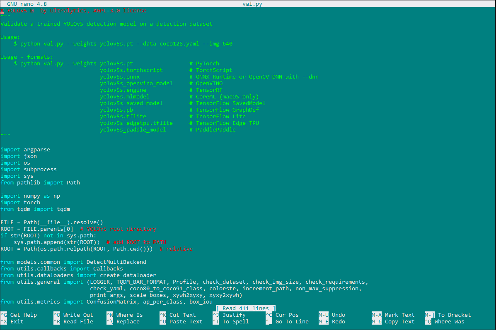
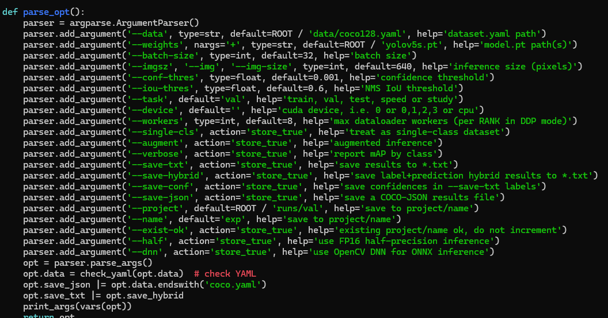
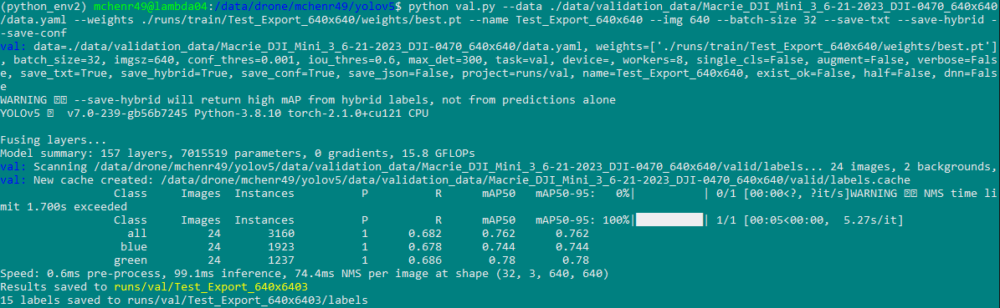
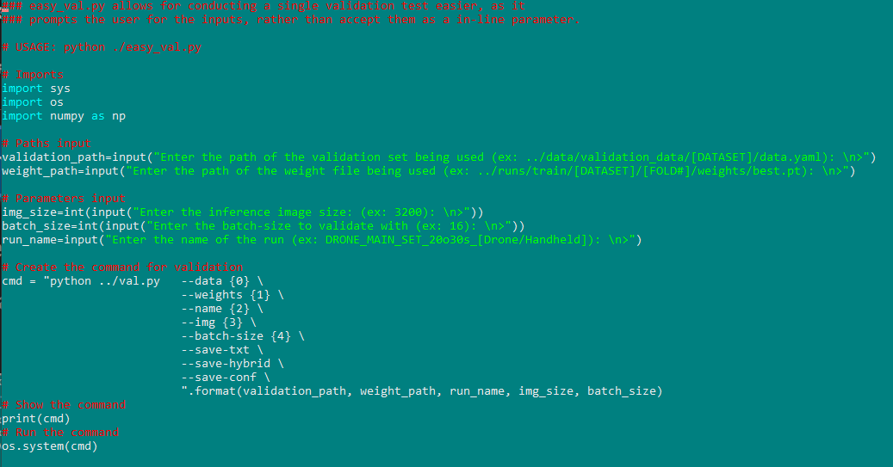

# Validating a YOLOv5 Model

After you successfully train your model (see [Training on YOLOv5](../yolo/training.md)), you might want to validate your model on different validation sets. In order to validate, we will need a dataset to validate on.

<pre>
Avoid validating on any data that was used to train the model. If you're unsure if the images you want to validate on were also part of the dataset you used to train, then double-check what images are included in each dataset (and what datasets are in other datasets) via our spreadsheet: <a href =https://docs.google.com/spreadsheets/d/1qnTFFXdrRZ5QKtECGf_HoBcVre596mKpFtnSKpVMaTI/edit#gid=0>Annotation Dataset Tracking spreadsheet</a>
</pre>

## Understanding the `val.py` Script

To get an idea of how to use `val.py`, let’s see what can figure out by opening it in a text editor, anything works but I'll use nano: `nano val.py`

At the top we should see some examples of how we can use this script. (It's good practice to include these at the top of your scripts as well.)

### Usage
According to their Usage comment, the following command would validate: `python val.py --weights yolov5s.pt --data coco128.yaml --img 640`

This example seems pretty simple, but only if you use a couple of parameters, there are many settings/parameters that we can pass in, so let's get an idea of what those look like. 

Scrolling down in this script, we can find a `parse_opt` function and get an idea of all the different parameters we can use (and their defaults).

(Can you tell this photo is newer?)

### Notable parameters:
<ul>
<li>weights - The weight file from training that you're using.
<li>data - The path to the data.yaml of the dataset you are validating.
<li>img/imgsz - The dimension of the images in the dataset (assumes it is square).
<li>name - The name of the job.
<li>batch-size - The batch-size of the validation job. (Not very necessary)
<li>save-txt - Saves label results to a text file.
<li>save-hybrid - Saves label & prediction hybrid results to a text file.
<li>save-conf - Saves confidences for the labels in the save-txt file.

</ul>

If you want to read more about the parameters, there's a bit more information here: https://github.com/ultralytics/yolov5/issues/6507

## Preparing a Validation Dataset

Similar to training, you will need to prepare your dataset for validation. You shouldn't necessarily apply a bunch of augmentations for validation, but at the very least, the images you validate on should be the same size you train with (640x640, etc.).

## Using `val.py`

Using what we learned about `val.py`, let’s start validating. 

We’ll specify the path for our data.yaml file in the dataset we're validating on, the path to our best weights from training, the name of the finished training run, and the size of the images in our dataset. We'll also specify the batch-size, and a few other options to save additional results.

Command: `python val.py --data ./data/validation_data/DATASET_NAME/data.yaml --weights ./runs/train/DATASET_NAME/weights/best.pt --name DATASET_NAME --img 640 --batch-size 32 --save-txt --save-hybrid --save-conf`

After successfully validating, you will receive a table of metrics that shows your model's performance on this validation set.

If you were to validate on the validation data that was used during training, it <i>SHOULD</i> result in roughly the same metrics.

## Seeing the Results

All results are saved to the `/yolov5/runs/val/DATASET_NAME/` directory.

## Using `easy_val.py`

In classic <i>Brandon fashion</i>, there exists a script for making using the included `val.py` script a bit easier to use. 

By running the command `python easy_val.py` you will be prompted for input for the parameters we manually typed in when using `val.py`. It accomplishes the same thing, but in a more manageable way.

## Conclusion

You now know how to:
<ul>
<li>Validate a trained model using your own validation dataset
</ul>

---

With this information, you will likely want to continue on to [Making Predictions with YOLOv5](../yolo/predicting.md).
