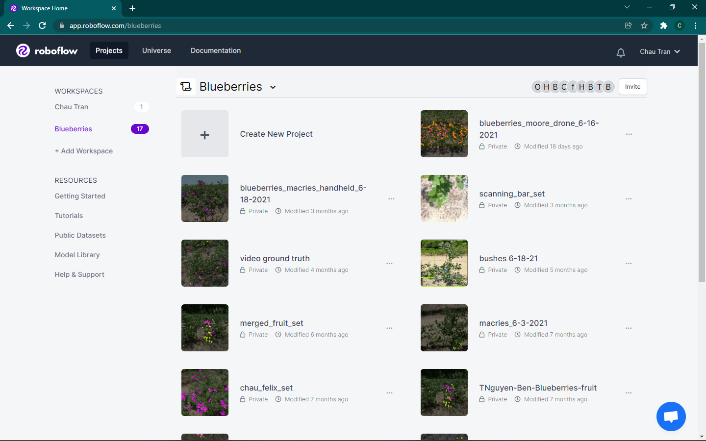

# YOLOv5
```{note}
Make sure you have been added to the team's Roboflow and you have access the Lambda server before the following steps.
```

## Repository Setup
Login to the Lambda server. `cd` into your own directory in the `/data/drone` project folder.
To clone Ocho-lytic's YOLOv5 repository, run:
```md
git clone https://github.com/ultralytics/yolov5
```
You should now have the repository cloned into your personal directory.

## Custom Data Preparation
Before training with a YOLOv5 model, a dataset in YOLOv5 format is needed. 

### Step 1
First, select the Roboflow dataset you would like to use:


In this example, we will use Brandon's dataset.
### Step 2


If there are no versions available make one and apply the appropriate preprocessing and augmentation steps. Most of the time, this would mean applying NO preprocessing or augmentations at all since we perform those steps outside of Roboflow.
### Step 3
After you have selected a dataset version, click `Export`. This modal should pop up:


Click the dropdown bar under `Format` and choose `YOLO v5 PyTorch`. Also make sure you have the `show download code` radio box selected. Now, click `Continue`.

### Step 4
Afterwards, you should see this modal:


Select the `Terminal` tab and make sure to copy the command line command - you will paste it into Lambda in the next few steps.

### Step 5
Go back into the Lambda server and `cd` into the yolov5 repository that you have cloned.

Next, `cd` into the `data` directory inside yolov5. Then, make a new dataset:
```md
mkdir blueberry_dataset
```
(You can really name it anything you want - it does not matter.)

### Step 6
Next, `cd` into this new directory you have made.
To download the dataset from Roboflow, paste the command you have copied. The dataset along with its annotations should be dumped into the current directory that you are in.

### Step 7
Now, we need to configure the `data.yaml` file so it works with our current file structure.
Edit the `data.yaml` file (you can use vim or nano if you're doing it from the terminal) and change the following:

Change ```train: ../train/images``` to ```train: ./data/blueberry_dataset/train/images```

Change ```val: ../valid/images``` to ```val: ./data/blueberry_dataset/valid/images``` (if there is one, if not, use the same directory as training)

_Update: 6/28/2023 - These instructions have changed for some versions._

Change default path to ```path: ./data/blueberry_dataset```

Change ```train: ../train/images``` to ```train: train/images```

Change ```val: ../valid/images``` to ```val: valid/images``` (if there is one, if not, use the same directory as training)

From here, you are ready to train on this data.

## Training

`cd` back into the top-level of the yolov5 repository.
Very basically, you can train on the data with some default configurations with:
```{note}
Also make sure you have activated the Python environment!
```
```md
python train.py --data ./data/blueberry_dataset/data.yaml
```

To configure parameters like epochs, output location, etc., I highly recommend checking out the `train.py` file for a list of more arguments you can pass in. It is located in the `parse_opt` function.

Afterwards, the trained weights should be outputted to the directory `runs/train/exp[number]/weights`. These weights (best and last) should be in `.pt` format, for which you'll feed into the inference step.

## Inference

To run the model on a particular image/directory of images/video, make sure you have the file somewhere on Lambda. Then, use the `detect.py` script:
```md
python detect.py --weights [the location of your .pt file] --source [the location of the image/images/video/videos that you want to infer on] --name [where the results will be dumped]
```

Again, you can change A LOT more parameters. Look into the `parse_opt` function of `detect.py` for a full list of options.


## Update History

Updated by Brandon McHenry, on 6/28/2023. Fixed data.yaml to include path variable; changed detect.py 'output' flag to 'name'.

